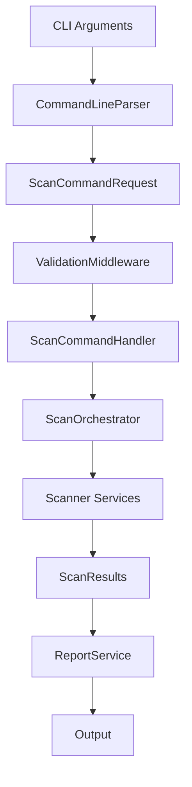
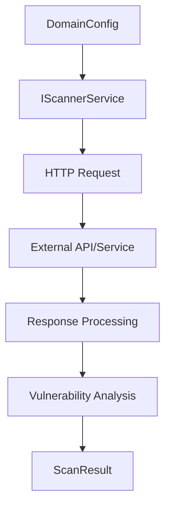

# Architecture Documentation

## Overview

SecurityScanner follows Clean Architecture principles with clear separation of concerns across multiple projects. The architecture emphasizes modularity, testability, and maintainability.

## Project Structure

```
SecurityScanner/
├── src/
│   ├── SecurityScanner.Core/          # Domain models and interfaces
│   ├── SecurityScanner.Infrastructure/ # External dependencies
│   ├── SecurityScanner.Services/      # Business logic
│   ├── SecurityScanner.Commands/      # CLI command handling
│   └── SecurityScanner.App/           # Application entry point
├── tests/                             # Unit and integration tests
└── docs/                              # Documentation
```

## Clean Architecture Layers

### 1. Core Layer (`SecurityScanner.Core`)

**Dependencies**: None (pure domain layer)

**Purpose**: Contains core domain models, interfaces, and business rules.

**Key Components**:
- `Models/` - Domain entities (ScanResult, VulnerabilityReport, ScanConfiguration)
- `Interfaces/` - Service contracts (IScannerService, IReportService, ICommandHandler)
- `Enums/` - Domain enumerations (ScanStatus, SeverityLevel, ScannerType)
- `Exceptions/` - Domain-specific exceptions

**Example**:
```csharp
public interface IScannerService
{
    string ServiceName { get; }
    ScannerType ScannerType { get; }
    Task<ScanResult> ScanAsync(DomainConfig domain, CancellationToken cancellationToken);
}
```

### 2. Infrastructure Layer (`SecurityScanner.Infrastructure`)

**Dependencies**: Core

**Purpose**: Handles external concerns like HTTP clients, logging, and file I/O.

**Key Components**:
- `Configuration/` - Configuration models and extensions
- `Http/` - HTTP client factory and rate limiting
- `Logging/` - Logging configuration and extensions
- `Persistence/` - File storage and data persistence

### 3. Services Layer (`SecurityScanner.Services`)

**Dependencies**: Core, Infrastructure

**Purpose**: Implements business logic and scanner services.

**Key Components**:
- `Scanners/` - Scanner implementations (SecurityHeaders, SslLabs, OwaspZap, LoadTest)
- `Orchestration/` - Scan coordination and management
- `Reports/` - Report generation and formatting
- `Notifications/` - Alert and notification services

### 4. Commands Layer (`SecurityScanner.Commands`)

**Dependencies**: Core, Services

**Purpose**: Handles command-line interface and request processing.

**Key Components**:
- `Handlers/` - Command handlers (Scan, Report, Config, Health)
- `Middleware/` - Processing pipeline (Validation, Logging, Error handling)
- `Parsing/` - Command-line argument parsing
- `Validation/` - Request validation rules

### 5. Application Layer (`SecurityScanner.App`)

**Dependencies**: All layers

**Purpose**: Application entry point and dependency injection setup.

**Key Components**:
- `Program.cs` - Main application entry point
- `Extensions/` - Service registration and configuration
- `appsettings.json` - Application configuration

## Design Patterns

### 1. Command Pattern

All operations are modeled as commands with request/response objects:

```csharp
public interface ICommandHandler<TRequest, TResponse>
    where TRequest : CommandRequest
    where TResponse : CommandResponse
{
    Task<TResponse> HandleAsync(TRequest request, CancellationToken cancellationToken);
}
```

### 2. Middleware Pipeline

Request processing uses a middleware pipeline for cross-cutting concerns:

```
Request → Validation → Logging → Error Handling → Command Handler → Response
```

### 3. Strategy Pattern

Scanner services implement a common interface allowing runtime selection:

```csharp
public class ScanOrchestrator
{
    private readonly IEnumerable<IScannerService> _scanners;
    
    public async Task<ScanResult> ExecuteScanAsync(ScannerType type, DomainConfig domain)
    {
        var scanner = _scanners.FirstOrDefault(s => s.ScannerType == type);
        return await scanner.ScanAsync(domain);
    }
}
```

### 4. Factory Pattern

HTTP clients are created using the factory pattern with configuration:

```csharp
public class HttpClientFactory
{
    public HttpClient CreateClient(string name, TimeSpan timeout, Dictionary<string, string> headers)
    {
        // Factory implementation
    }
}
```

## Data Flow

### 1. Scan Request Processing



### 2. Scanner Service Flow



## Dependency Injection

### Service Registration

```csharp
public static class ServiceCollectionExtensions
{
    public static IServiceCollection AddSecurityScannerServices(
        this IServiceCollection services, 
        IConfiguration configuration)
    {
        // Core services
        services.AddSingleton<IScanOrchestrator, ScanOrchestrator>();
        services.AddSingleton<IReportService, ReportService>();
        
        // Scanner services
        services.AddTransient<IScannerService, SecurityHeadersService>();
        services.AddTransient<IScannerService, SslLabsService>();
        services.AddTransient<IScannerService, OwaspZapService>();
        services.AddTransient<IScannerService, LoadTestService>();
        
        // Command handlers
        services.AddTransient<IScanCommandHandler, ScanCommandHandler>();
        services.AddTransient<IReportCommandHandler, ReportCommandHandler>();
        
        // Middleware
        services.AddTransient<IValidationMiddleware, ValidationMiddleware>();
        services.AddTransient<ILoggingMiddleware, LoggingMiddleware>();
        
        return services;
    }
}
```

### Configuration Binding

```csharp
services.Configure<ScannerSettings>(configuration.GetSection("ScannerSettings"));
services.Configure<PerformanceSettings>(configuration.GetSection("PerformanceSettings"));
```

## Error Handling

### Exception Hierarchy

```csharp
public class ScannerException : Exception
{
    public ScannerType ScannerType { get; }
    public string DomainName { get; }
}

public class ConfigurationException : ScannerException
{
    public string ConfigurationKey { get; }
}

public class ServiceUnavailableException : ScannerException
{
    public string ServiceUrl { get; }
}
```

### Error Handling Middleware

```csharp
public class ErrorHandlingMiddleware
{
    public async Task<TResponse> ExecuteAsync<TRequest, TResponse>(
        TRequest request,
        Func<TRequest, Task<TResponse>> next)
    {
        try
        {
            return await next(request);
        }
        catch (ScannerException ex)
        {
            return CreateErrorResponse<TResponse>(ex);
        }
    }
}
```

## Concurrency and Performance

### Concurrent Scan Execution

```csharp
public async Task<IEnumerable<ScanResult>> ExecuteParallelScansAsync(
    ScanConfiguration config, 
    CancellationToken cancellationToken)
{
    var semaphore = new SemaphoreSlim(config.MaxConcurrentScans);
    var tasks = new List<Task<ScanResult>>();
    
    foreach (var domain in config.Domains)
    {
        tasks.Add(ExecuteScanWithSemaphoreAsync(domain, semaphore, cancellationToken));
    }
    
    return await Task.WhenAll(tasks);
}
```

### Rate Limiting

```csharp
public class RateLimitingHandler : DelegatingHandler
{
    private readonly SemaphoreSlim _semaphore;
    private readonly TimeSpan _delay;
    
    protected override async Task<HttpResponseMessage> SendAsync(
        HttpRequestMessage request, 
        CancellationToken cancellationToken)
    {
        await _semaphore.WaitAsync(cancellationToken);
        try
        {
            var response = await base.SendAsync(request, cancellationToken);
            await Task.Delay(_delay, cancellationToken);
            return response;
        }
        finally
        {
            _semaphore.Release();
        }
    }
}
```

## Testing Architecture

### Unit Testing Structure

```
tests/
├── SecurityScanner.Core.Tests/
│   ├── Models/
│   ├── Interfaces/
│   └── Validation/
├── SecurityScanner.Services.Tests/
│   ├── Scanners/
│   ├── Orchestration/
│   └── Reports/
├── SecurityScanner.Commands.Tests/
│   ├── Handlers/
│   ├── Middleware/
│   └── Parsing/
└── SecurityScanner.Integration.Tests/
    ├── EndToEnd/
    └── External/
```

### Mock Strategy

```csharp
[Test]
public async Task ScanAsync_ValidDomain_ReturnsScanResult()
{
    // Arrange
    var httpClient = new Mock<HttpClient>();
    var logger = new Mock<ILogger<SecurityHeadersService>>();
    var service = new SecurityHeadersService(httpClient.Object, logger.Object);
    
    // Act
    var result = await service.ScanAsync(domain);
    
    // Assert
    Assert.That(result.Status, Is.EqualTo(ScanStatus.Completed));
}
```

## Security Architecture

### Input Validation

```csharp
public class ScanCommandRequestValidator : AbstractValidator<ScanCommandRequest>
{
    public ScanCommandRequestValidator()
    {
        RuleFor(x => x.Domains)
            .Must(domains => domains.All(BeValidDomain))
            .WithMessage("All domains must be valid");
    }
    
    private bool BeValidDomain(string domain)
    {
        // Validation logic
    }
}
```

### API Key Management

```csharp
public class ApiKeyService
{
    private readonly IConfiguration _configuration;
    
    public string GetApiKey(string serviceName)
    {
        return _configuration[$"ScannerSettings:{serviceName}:ApiKey"] 
            ?? Environment.GetEnvironmentVariable($"SCANNER_{serviceName}__ApiKey");
    }
}
```

## Extension Points

### Adding New Scanners

1. Implement `IScannerService` interface
2. Register in DI container
3. Add to command-line tool selection
4. Create unit tests

```csharp
public class CustomScannerService : IScannerService
{
    public string ServiceName => "Custom Scanner";
    public ScannerType ScannerType => ScannerType.Custom;
    
    public async Task<ScanResult> ScanAsync(DomainConfig domain, CancellationToken cancellationToken)
    {
        // Implementation
    }
}
```

### Adding New Commands

1. Create command request/response models
2. Implement command handler
3. Add to command-line parser
4. Register in DI container

```csharp
public class CustomCommandHandler : ICommandHandler<CustomCommandRequest, CustomCommandResponse>
{
    public async Task<CustomCommandResponse> HandleAsync(CustomCommandRequest request, CancellationToken cancellationToken)
    {
        // Implementation
    }
}
```

## Performance Considerations

### Memory Management

- Use `IAsyncEnumerable` for large datasets
- Implement proper disposal patterns
- Monitor memory usage during concurrent scans

### Scalability

- Horizontal scaling through multiple instances
- Database storage for results persistence
- Message queues for background processing

### Monitoring

- Structured logging with correlation IDs
- Performance counters and metrics
- Health checks for external dependencies

## Future Enhancements

### Planned Features

1. **Plugin System** - Dynamic scanner loading
2. **Database Integration** - Persistent result storage
3. **Web UI** - Browser-based interface
4. **Distributed Scanning** - Multi-node execution
5. **Advanced Reporting** - Trend analysis and dashboards

### Architecture Evolution

1. **Microservices** - Split into independent services
2. **Event-Driven** - Asynchronous processing with events
3. **Cloud-Native** - Container and Kubernetes deployment
4. **API Gateway** - Centralized API management

## Best Practices

### Code Organization

- Keep interfaces in Core project
- Implement cross-cutting concerns in Infrastructure
- Business logic belongs in Services
- UI/CLI concerns in Commands and App

### Dependencies

- Follow dependency inversion principle
- Use interfaces for all external dependencies
- Avoid circular dependencies between projects
- Keep Core project dependency-free

### Testing

- Unit test all business logic
- Integration test external service interactions
- Mock external dependencies
- Test error scenarios and edge cases

## Conclusion

The SecurityScanner architecture prioritizes maintainability, testability, and extensibility. The clean separation of concerns allows for easy modification and extension while maintaining a consistent structure across all components.

For implementation details, refer to the [Development Guide](development.md) and specific [Scanner Documentation](scanners/).